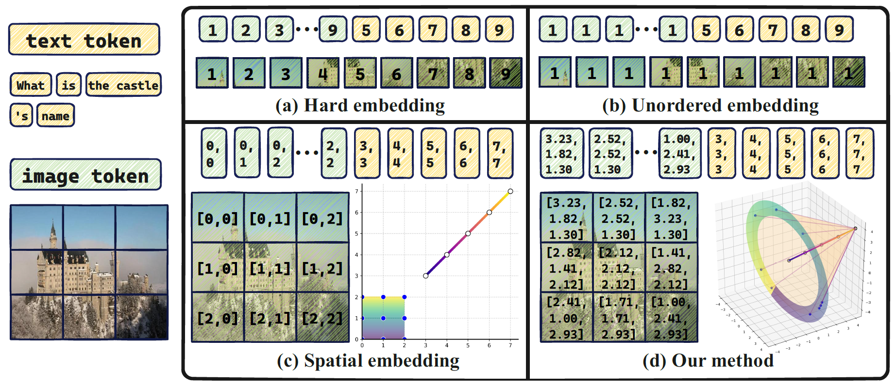

# Circle-RoPE: Cone-like Decoupled Rotary Positional Embedding for Large Vision-Language Models 

<div align="center">
  <a href="https://arxiv.org/abs/2505.16416" style="font-size: 22px;"><b>arXiv Paper Link</b>👁️</a>
</div>


We introduce Circle-RoPE, a novel encoding scheme that maps image token indices onto a circular trajectory orthogonal to the linear path of text token indices, forming a cone-like structure.    This configuration ensures that each text token maintains an equal distance to all image tokens, reducing artificial cross-modal biases while preserving intra-image spatial information. Our experimental results demonstrate that our method effectively preserves spatial information from images while reducing relative positional bias, offering a more robust and flexible positional encoding framework for LVLMs. 

<div align="center">
  
</div>

## Code
We provide an implementation based on Qwen2.5-VL, and the specific code can be found in the `code` folder.

## Citation

If you find our work helpful, feel free to give us a cite.

```bibtex
@misc{wang2025circlerope,
  title={Circle-RoPE: Cone-like Decoupled Rotary Positional Embedding for Large Vision-Language Models},
  author={Chengcheng Wang and Jianyuan Guo and Hongguang Li and Yuchuan Tian and Ying Nie and Chang Xu and Kai Han},
  year={2025},
  eprint={2505.16416},
  archivePrefix={arXiv},
  primaryClass={cs.CV},
  url={https://arxiv.org/abs/2505.16416},
}
```


